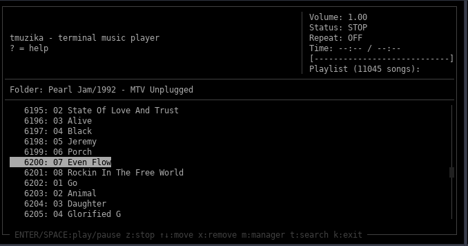
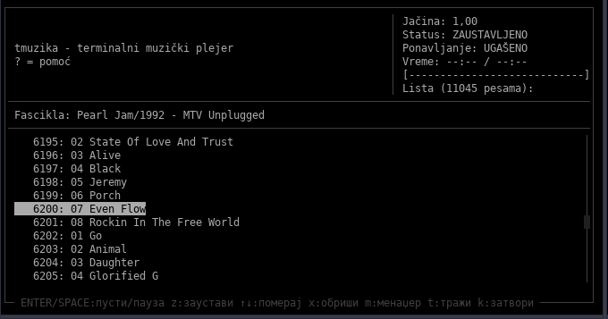
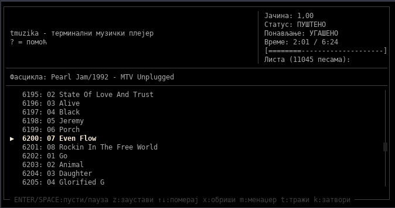
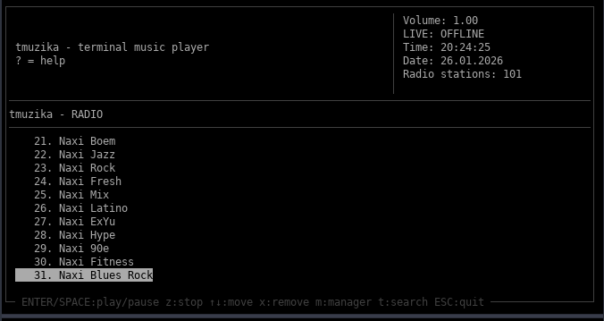
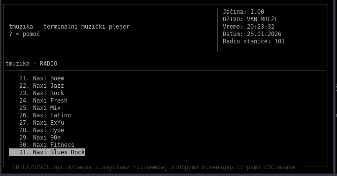
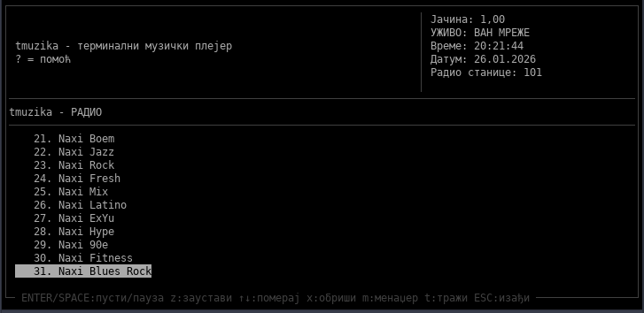
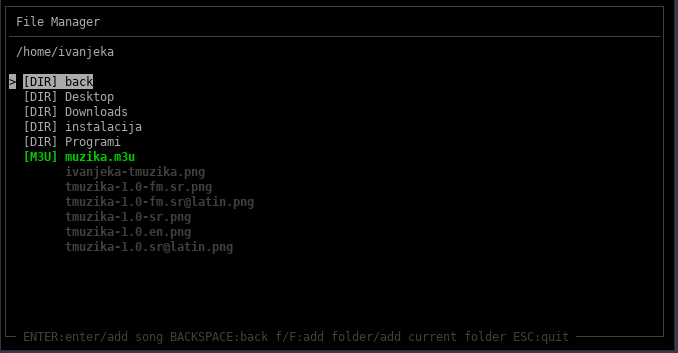
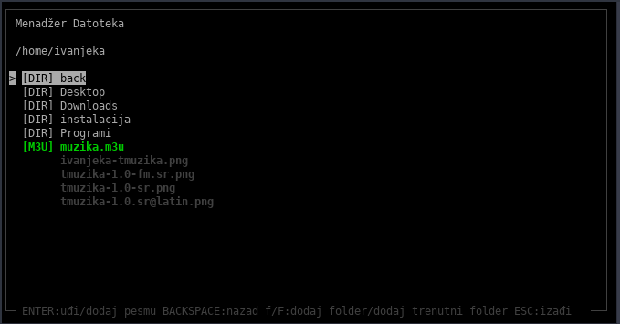
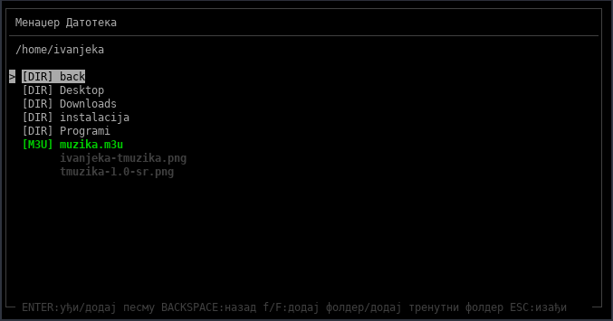
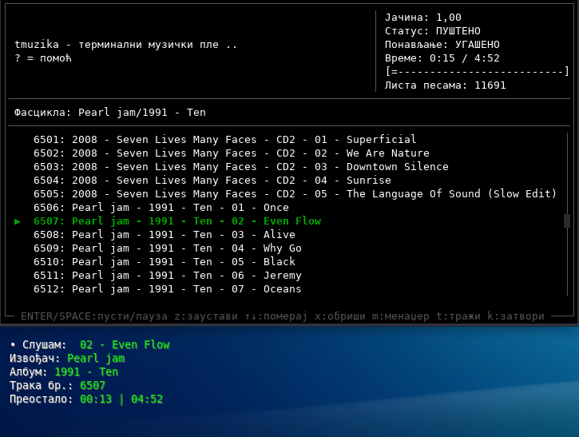

# tmuzika

Terminal music player written in C, using **ncurses** and **GStreamer**.

tmuzika is designed for fast and simple music playback directly in the terminal, with full keyboard control.
User configuration and data are stored in `~/.tmuzika`.

---

## Screenshots

### tmuzika

#### English


#### Serbian Latin


#### Serbian Cyrillic



### tmuzika-radio

#### English


#### Serbian Latin


#### Serbian Cyrillic



### tmuzika-fm

#### English


#### Serbian Latin


#### Serbian Cyrillic


---
## Features

- Terminal music playback (ncurses UI)
- Terminal radio station playback (ncurses UI)
- Integrated file manager (copy, cut, paste, rename, delete, undo, bookmarks)
- Add files or entire folders (recursive)
- Save / Load `.m3u` playlists
- Search songs / radio stations
- Remember last played song / radio station
- Scroll through lists with keyboard or scroll wheel

Supported audio formats: `mp3`, `wav`, `flac`, `ogg`, `m4a`, `aac`, `opus`

---

## Key Bindings

### Playback

| Key       | Action                         |
|-----------|--------------------------------|
| ENTER     | Play selected song             |
| SPACE     | Pause / Continue               |
| b / n     | Scrol left/right               |
| z         | Stop playback                  |
| > / <     | Next / Previous song           |
| + / -     | Volume up / down               |
| <- / ->   | Jump ±10s                      |
| HOME / END| First / Last song              |
| p         | Repeat song                    |
| l         | Repeat playlist                |
| e         | Shuffle                        |
| s         | Search                         |
| m         | File Manager                   |
| q         | Save playlist (.m3u)           |
| u         | Load playlist                  |
| v         | Go to current song             |
| x         | Delete song from playlist      |
| DELETE    | Delete all songs from playlist |
| k         | Exit program                   |

### Playback Radio

| Key       | Action                                 |
|-----------|----------------------------------------|
| ENTER     | Play radio station                     |
| SPACE     | Pause / Continue                       |
| z         | Stop playback                          |
| > / <     | Next / Previous                        |
| + / -     | Volume up / down                       |
| d         | Add radio station                      |
| HOME / END| First / Last radio station             |
| s         | Search                                 |
| m         | File Manager                           |
| q         | Save playlist (.m3u)                   |
| u         | Load playlist                          |
| v         | Go to current radio station            |
| x         | Delete radio station from playlist     |
| DELETE    | Delete all radio station from playlist |
| ESC       | Quit Radio                             |

### File Manager

| Key           | Action                                |
|---------------|---------------------------------------|
| ENTER         | Enter directory / add song / add .m3u |
| BACKSPACE     | Go back                               |
| ctrl+h        | Toggle hidden files                   |
| f / F         | Add folder / add current folder       |
| m             | Select files / folders                |
| ctrl+a        | Select all files                      |
| d             | Add multiple files                    |
| s             | Search                                |
| n             | Create new folder                     |
| t             | Create new file                       |
| F2            | Rename file / folder                  |
| c             | Copy                                  |
| x             | Cut                                   |
| v             | Paste                                 |
| u             | Undo last action                      |
| ctrl+p        | Change file permissions (chmod)       |
| ctrl+o        | Open terminal                         |
| DELETE        | Remove file / folder                  |
| ctrl+b        | Add bookmark                          |
| ctrl+d        | Remove bookmark                       |
| 1-9           | Go to bookmark 1–9                    |
| ESC           | Quit file manager                     |

---

## CLI Usage

Play a song or playlist directly from terminal:

```bash
tmuzika -p song.mp3
tmuzika --play song.mp3
tmuzika -p playlist.m3u
tmuzika --play playlist.m3u
tmuzika -p folder/
tmuzika --play folder/
```
Play a radio station or radio playlist directly from terminal:

```bash
tmuzika -r radio.mp3
tmuzika --radio radio.mp3
tmuzika -r http://radiostation
tmuzika --radio http://radiostation
```
Help:

```bash
tmuzika -h
tmuzika --help
```

## Conky Integration



Example desktop with Conky displaying tmuzika playback information.

tmuzika writes current playback information to temporary files in /tmp.
Files are temporary and exist only while tmuzika is running (they may be removed after system reboot).
This allows external tools like Conky to display Now Playing info.

Requirements:
- Conky must be installed and running
- tmuzika must be playing audio

What tmuzika exports:
```
/tmp/tmuzika_status
/tmp/tmuzika_title
/tmp/tmuzika_artist
/tmp/tmuzika_album
/tmp/tmuzika_track
/tmp/tmuzika_elapsed
/tmp/tmuzika_length
```

Example Conky snippet:

```
TEXT
TEXT
${if_running tmuzika}
${if_match "${env LANG}" "sr_RS.UTF-8"}
• Слушам: ${execi 3 grep -m1 . /tmp/tmuzika_status} ${execi 2 grep -m1 . /tmp/tmuzika_title}
Извођач: ${execi 3 grep -m1 . /tmp/tmuzika_artist}
Албум: ${execi 3 grep -m1 . /tmp/tmuzika_album}
Трака бр.: ${execi 3 grep -m1 . /tmp/tmuzika_track}
Преостало: ${execi 3 grep -m1 . /tmp/tmuzika_elapsed} | ${execi 2 grep -m1 . /tmp/tmuzika_length}
${else}${if_match "${env LANG}" "sr_RS@latin.UTF-8"}
• Slušam: ${execi 3 grep -m1 . /tmp/tmuzika_status} ${execi 2 grep -m1 . /tmp/tmuzika_title}
Izvođač: ${execi 3 grep -m1 . /tmp/tmuzika_artist}
Album: ${execi 3 grep -m1 . /tmp/tmuzika_album}
Numera: ${execi 3 grep -m1 . /tmp/tmuzika_track}
Vreme: ${execi 3 grep -m1 . /tmp/tmuzika_elapsed} | ${execi 2 grep -m1 . /tmp/tmuzika_length}
${else}
• Now playing: ${execi 3 grep -m1 . /tmp/tmuzika_status} ${execi 2 grep -m1 . /tmp/tmuzika_title}
Artist: ${execi 3 grep -m1 . /tmp/tmuzika_artist}
Album: ${execi 3 grep -m1 . /tmp/tmuzika_album}
Track: ${execi 3 grep -m1 . /tmp/tmuzika_track}
Time: ${execi 3 grep -m1 . /tmp/tmuzika_elapsed} | ${execi 2 grep -m1 . /tmp/tmuzika_length}
${endif}
${endif}
${else}
${endif}
```

### Troubleshooting

If nothing is displayed:
- make sure tmuzika is running
- check that /tmp/tmuzika_* files exist
- verify Conky update interval

## Author and License

Ivan Janković — ivan.jankovic.unix@gmail.com

License: **GPL v3 or later**